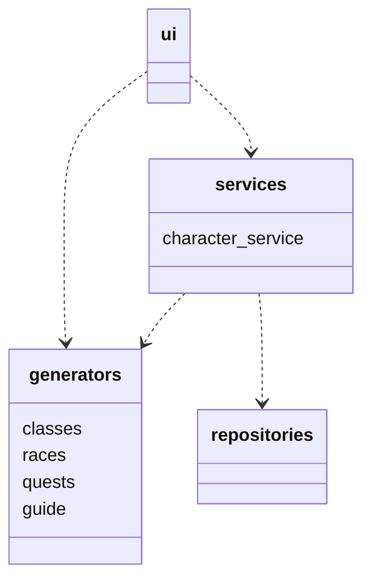
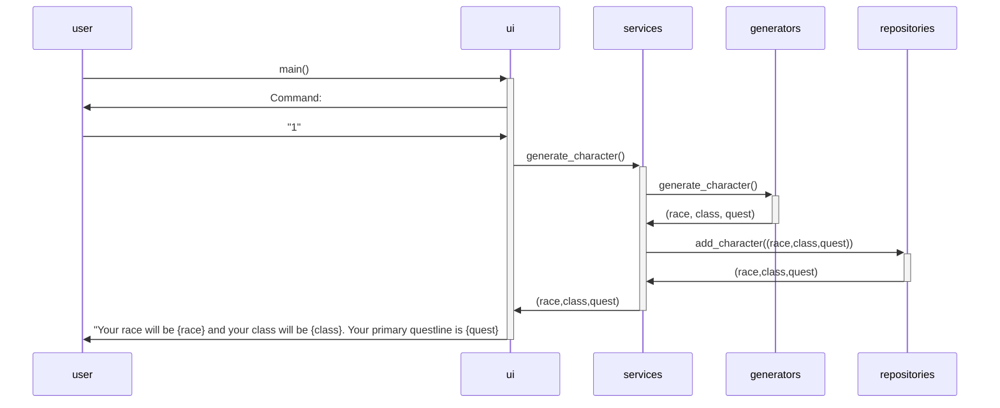

# Arkkitehtuurikuvaus
## Rakenne

Ohjelma noudattaa kerrosarkkitehtuuria, missä *ui* perii osan *services* ja *generators* hakemistojen luokista ja *services* perii *generators* ja *repositories* hakemistojen luokkia.
Ohjelman pakkausrakenne on seuraavanlainen:


*ui* vastaa sovelluksen käyttöliittymästä, *services* vastaa sovelluslogiikasta, *generators* vastaa hahmojen tuottamisesta ja *repositories* vastaa tietojen tallennuksesta.
## Käyttöliittymä
Käyttöliittymä on tekstikäyttöliittymä, jossa on lista komentoja, joiden toiminnot ovat:
```bash
0: keskeyttää ohjelman suorituksen
1: generoi pelihahmon
2: tulostaa kaikki generoidut pelihahmot
3: valitse generoiduista pelihahmoista, mille haluat tulostaa ohjeistuksen
4: poistaa kaikki tallennetut generoidut hahmot
```
3. komento antaa mahdollisuuden syöttää, joko 0 joka palaa päänäkymään tai 1..n missä n on generoitujen hahmojen määrä, jolloin käyttöliittymä tulostaa neuvoja valitulle hahmolle.
Käyttöliittymän komentojen sisältö päivittyy reaaliajassa komennoilla 1. (uusi hahmo luodaan) tai 4. (kaikki hahmot poistetaan)

## Sovelluslogiikka
Sovelluslogiikka koostuu pääosin services hakemiston character_service luokasta. Character_service käyttää apunaan generators hakemiston luokkia generoidakseen käyttäjälle haluttuja ominaisuuksia. Character_service luokassa on metodeja, jotka generoivat halutun asian, kuten uuden hahmon käyttäjälle metodilla generate_character(). Lisäksi character_servicen metodit tallentavat tai hakevat tietoa tiedostosta, johon generoidut hahmot tallennetaan. Muut character_servicen metodit ovat:
- `list_generated_characters()` muodostaa listan generoiduista hahmoista
- `delete_listed_characters()` poistaa kaikki tallennetut hahmot

Sovelluslogiikkaa on ehkä hieman päässyt valumaan käyttöliittymän puolelle printgameguidecommand osioon, missä käyttäjälle tulostetaan neuvoja hänen generoimalleen hahmolle. Tämän "guiden" generoimisen olisi voinut sisäistää myös character_services luokkaan.
## Tietojen pysyväistallennus
Sovellus tallentaa tietoa CSV-tiedostoihin repositories hakemiston character_service_repository luokan avulla. Tallennuksessa noudatetaan Repository - suunnittelumallia. Päämetodit luokan sisällä ovat `_read` ja `_write`. `_read` hakee tiedostosta kaikki rivit, erittelee rivin osiot ";" merkin avulla ja muodostaa riveistä listan. `_write_` taas muodostaa listasta string muuttujia muotoon `f"{race};{playclass};{quest}"` ja tallentaa ne tiedostoon rivinvaihdon kanssa. Tiedoston nimi ja tallennuspolku määritellään src hakemistossa olevassa [config.py](https://github.com/sampsaol/ot-harjoitustyo/blob/master/src/config.py) tiedostossa.
## Päätoiminnallisuudet

Yllä esimerkki sekvenssikaaviosta, kun sovellukselle annetaan käyttöliittymän kautta komento 1 eli generoidaan uusi hahmo. Sovellus siis generoi character_service luokan metodilla `generate_character()` uuden hahmon, tallentaa sen character_service_repository luokan avulla tiedostoon ja käyttöliittymä tulostaa käyttäjälle tiedot tästä generoidusta hahmosta. 

Muita toiminnallisuuksia on komento 2., jossa character_service luokan metodin `list_generated_characters()` avulla luodaan lista generoiduista hahmoista. `list_generated_characters` metodi käyttää character_service_repository luokkaa, joka muuntaa tiedoston riveistä listan, johon tulee generoidut hahmot. Tämä lista sitten tulostetaan käyttäjälle.

3 komento hakee 2 komennon lailla halutun listan, mutta siinä käytetään UI hakemiston print_game_guide_command luokkaa, johon haetaan lista generoiduista hahmoista ja käyttäjä valitsee mille hahmolle listasta hän haluaa neuvoja, jonka jälkeen käyttäjälle tulostetaan tarkempia tietoja hahmon toiminnasta.

4 komento käyttää character_service luokan metodia `delete_listed_characters()`, jolloin character_service_repository luokkaan lähetetään `_write()` komento ilman parametrejä ja tiedosto tyhjenee eli kaikki hahmot poistetaan.
