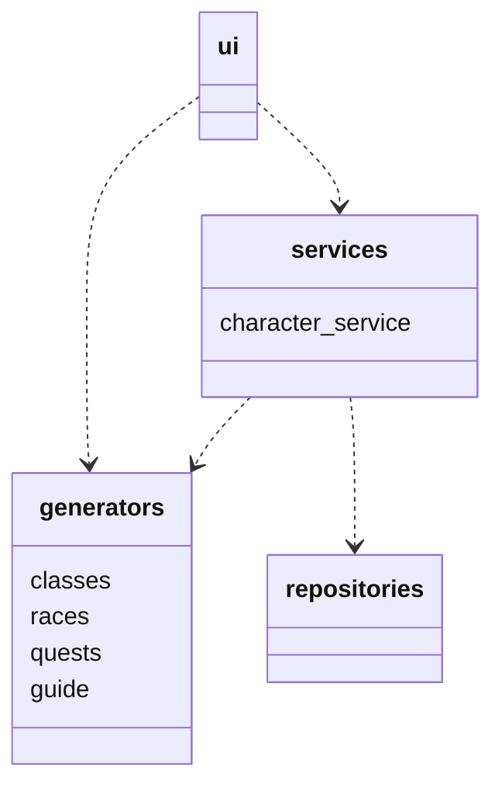
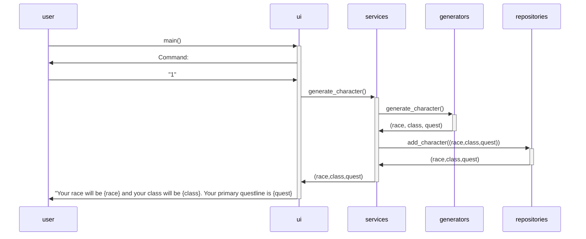

# Arkkitehtuurikuvaus
## Rakenne

Ohjelma noudattaa kerrosarkkitehtuuria, missä *ui* perii osan *services* ja *generators* hakemistojen luokista ja *services* perii *generators* ja *repositories* hakemistojen luokkia.
Ohjelman pakkausrakenne on seuraavanlainen:

*ui* vastaa sovelluksen käyttöliittymästä, *services* vastaa sovelluslogiikasta, *generators* vastaa hahmojen tuottamisesta ja *repositories* vastaa tietojen tallennuksesta.

## Päätoiminnallisuudet

Käyttäjä voi generoida satunnaisia pelihahmoja itselleen, jotka sovellus sitten tallentaa määriteltyyn tiedostoon. Käyttäjä antaa UI:lle komennon, UI lähettää sen CharacterServiceen, joka generoi generators hakemiston avulla rodun, pelityylin ja questlinen. Sitten CharacterService tallentaa tiedoston repositories avulla ja lähettää generoidun hahmon UI:lle joka tulostaa sen käyttäjälle.
