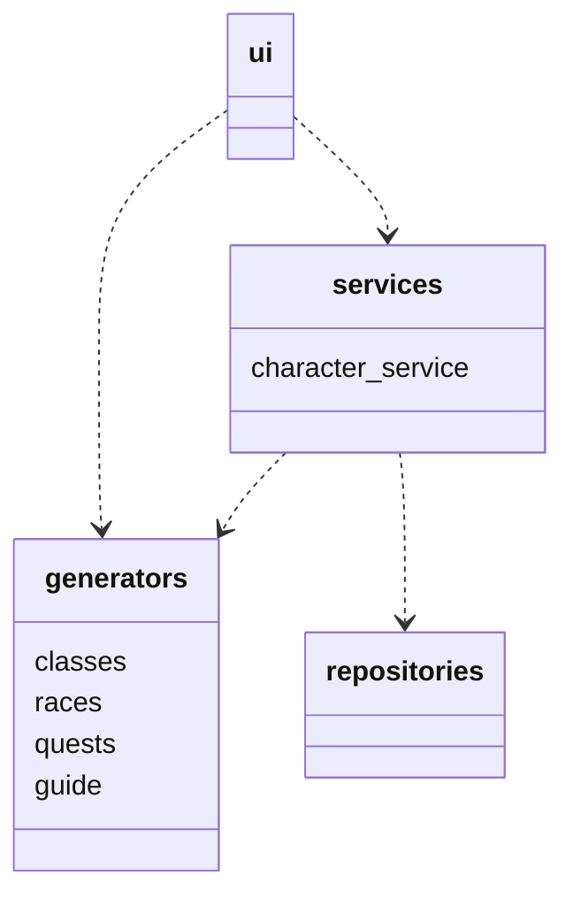

# Arkkitehtuurikuvaus
## Rakenne

Ohjelma noudattaa kerrosarkkitehtuuria, missä *ui* perii osan *services* ja *generators* hakemistojen luokista ja *services* perii *generators* ja *repositories* hakemistojen luokkia.
Ohjelman pakkausrakenne on seuraavanlainen:


*ui* vastaa sovelluksen käyttöliittymästä, *services* vastaa sovelluslogiikasta, *generators* vastaa hahmojen tuottamisesta ja *repositories* vastaa tietojen tallennuksesta.

```mermaid
sequenceDiagram


```
