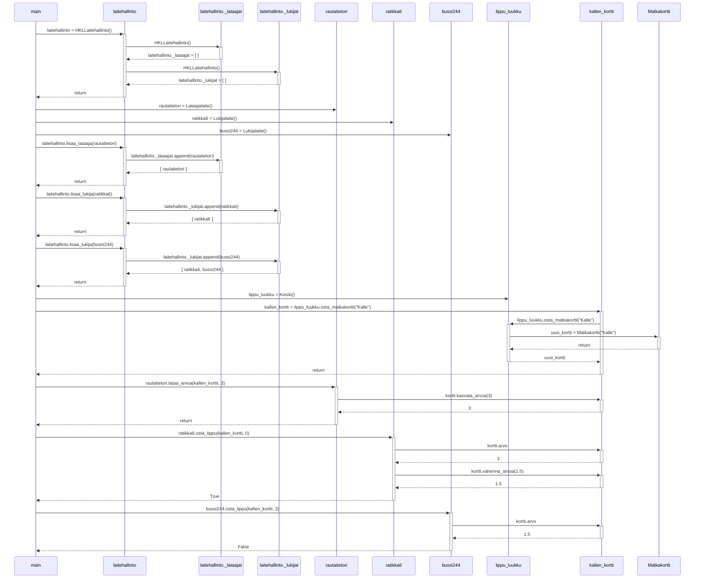

```mermaid
  sequenceDiagram
    participant main
    participant laitehallinto
    participant laitehallinto._lataajat
    participant laitehallinto._lukijat
    participant rautatietori
    participant ratikka6
    participant bussi244
    participant lippu_luukku
    participant kallen_kortti
    participant Matkakortti
    main->>+laitehallinto: laitehallinto = HKLLaitehallinto()
    laitehallinto->>+laitehallinto._lataajat: HKLLaitehallinto()
    laitehallinto._lataajat-->>-laitehallinto: laitehallinto._lataajat = [ ]
    laitehallinto->>+laitehallinto._lukijat: HKLLaitehallinto()
    laitehallinto._lukijat-->>-laitehallinto: laitehallinto._lukijat = [ ]
    laitehallinto-->>-main: return
    main->>rautatietori: rautatietori = Lataajalaite()
    main->>ratikka6: ratikka6 = Lukijalaite()
    main->>bussi244: bussi244 = Lukijalaite()
    main->>+laitehallinto: laitehallinto.lisaa_lataaja(rautatietori)
    laitehallinto->>+laitehallinto._lataajat: laitehallinto._lataajat.append(rautatietori)
    laitehallinto._lataajat-->>-laitehallinto: [ rautatietori ]
    laitehallinto-->>-main: return
    main->>+laitehallinto: laitehallinto.lisaa_lukija(ratikka6)
    laitehallinto->>+laitehallinto._lukijat: laitehallinto._lukijat.append(ratikka6)
    laitehallinto._lukijat-->>-laitehallinto: [ ratikka6 ]
    laitehallinto-->>-main: return
    main->>+laitehallinto: laitehallinto.lisaa_lukija(bussi244)
    laitehallinto->>+laitehallinto._lukijat: laitehallinto._lukijat.append(bussi244)
    laitehallinto._lukijat-->>-laitehallinto: [ ratikka6, bussi244 ]
    laitehallinto-->>-main: return
    main->>lippu_luukku: lippu_luukku = Kioski()
    main->>+kallen_kortti: kallen_kortti = lippu_luukku.osta_matkakortti("Kalle")
    kallen_kortti->>+lippu_luukku: lippu_luukku.osta_matkakortti("Kalle")
    lippu_luukku->>+Matkakortti: uusi_kortti = Matkakortti("Kalle")
    Matkakortti-->>-lippu_luukku: return
    lippu_luukku-->>-kallen_kortti: uusi_kortti
    kallen_kortti-->>-main: return
    main->>+rautatietori: rautatietori.lataa_arvoa(kallen_kortti, 3)
    rautatietori->>+kallen_kortti: kortti.kasvata_arvoa(3)
    kallen_kortti-->>-rautatietori: 3
    rautatietori-->>-main: return
    main->>+ratikka6: ratikka6.osta_lippu(kallen_kortti, 0)
    ratikka6->>+kallen_kortti: kortti.arvo
    kallen_kortti-->>-ratikka6: 3
    ratikka6->>+kallen_kortti: kortti.vahenna_arvoa(1.5)
    kallen_kortti-->>-ratikka6: 1.5
    ratikka6-->>-main: True
    main->>+bussi244: bussi244.osta_lippu(kallen_kortti, 2)
    bussi244->>+kallen_kortti: kortti.arvo
    kallen_kortti-->>-bussi244: 1.5
    bussi244-->>-main: False
    
```
