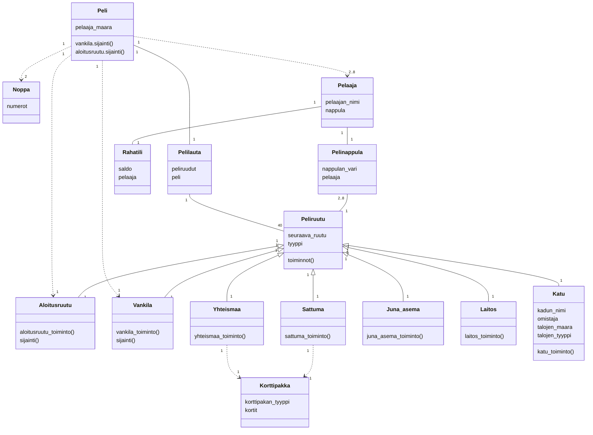

```mermaid
classDiagram
  Peli "1" ..> "2" Noppa
  Peli "1" ..> "2..8" Pelaaja
  Peli "1" -- "1" Pelilauta
  Pelaaja "1" -- "1" Pelinappula
  Pelinappula "2..8" -- "1" Peliruutu
  Pelilauta "1" -- "40" Peliruutu
  Peliruutu "1" <|-- "1" Aloitusruutu
  Peliruutu "1" <|-- "1" Vankila
  Peliruutu "1" <|-- "1" Sattuma
  Peliruutu "1" <|-- "1" Yhteismaa
  Peliruutu "1" <|-- "1" Juna_asema
  Peliruutu "1" <|-- "1" Laitos
  Peliruutu "1" <|-- "1" Katu
  Peli "1" ..> "1" Aloitusruutu
  Peli "1" ..> "1" Vankila
  Pelaaja "1" -- "1" Rahatili
  Sattuma "1" ..> "1" Korttipakka
  Yhteismaa "1" ..> "1" Korttipakka
  class Peliruutu{
    seuraava_ruutu
    tyyppi
    toiminnot()
  }
  class Peli{
    pelaaja_maara
    vankila.sijainti()
    aloitusruutu.sijainti()
  }
  class Pelinappula{
    nappulan_vari
    pelaaja
  }
  class Pelaaja{
    pelaajan_nimi
    nappula
  }
  class Rahatili{
    saldo
    pelaaja
  }
  class Pelilauta{
    peliruudut
    peli
  }
  class Noppa{
    numerot
  }
  class Aloitusruutu{
    aloitusruutu_toiminto()
    sijainti()
  }
  class Vankila{
    vankila_toiminto()
    sijainti()
  }
  class Sattuma{
    sattuma_toiminto()
  }
  class Yhteismaa{
    yhteismaa_toiminto()
  }
  class Juna_asema{
    juna_asema_toiminto()
  }
  class Laitos{
    laitos_toiminto()
  }
  class Katu{
    kadun_nimi
    omistaja
    talojen_maara
    talojen_tyyppi
    katu_toiminto()
  }
  class Korttipakka{
    korttipakan_tyyppi
    kortit
  }
```
