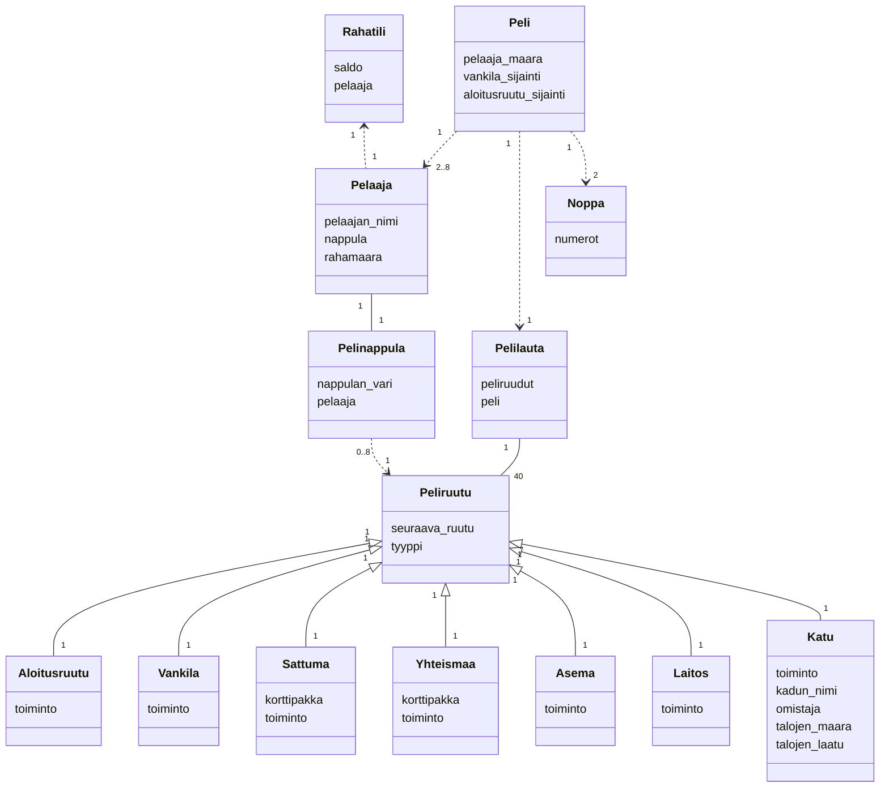

```mermaid
classDiagram
  Peli "1" ..> "2..8" Pelaaja
  Peli "1" ..> "1" Pelilauta
  Peli "1" ..> "2" Noppa
  Pelaaja "1" -- "1" Pelinappula
  Pelinappula "0..8" ..> "1" Peliruutu
  Pelilauta "1" -- "40" Peliruutu
  Peliruutu "1" <|-- "1" Aloitusruutu
  Peliruutu "1" <|-- "1" Vankila
  Peliruutu "1" <|-- "1" Sattuma
  Peliruutu "1" <|-- "1" Yhteismaa
  Peliruutu "1" <|-- "1" Asema
  Peliruutu "1" <|-- "1" Laitos
  Peliruutu "1" <|-- "1" Katu
  Rahatili "1" <.. "1" Pelaaja
  class Peliruutu{
    seuraava_ruutu
    tyyppi
  }
  class Peli{
    pelaaja_maara
    vankila_sijainti
    aloitusruutu_sijainti
  }
  class Pelinappula{
    nappulan_vari
    pelaaja
  }
  class Pelaaja{
    pelaajan_nimi
    nappula
    rahamaara
  }
  class Rahatili{
    saldo
    pelaaja
  }
  class Pelilauta{
    peliruudut
    peli
  }
  class Noppa{
    numerot
  }
  class Aloitusruutu{
    toiminto
  }
  class Vankila{
    toiminto
  }
  class Sattuma{
    korttipakka
    toiminto
  }
  class Yhteismaa{
    korttipakka
    toiminto
  }
  class Asema{
    toiminto
  }
  class Laitos{
    toiminto
  }
  class Katu{
    toiminto
    kadun_nimi
    omistaja
    talojen_maara
    talojen_laatu
  }
    


```
