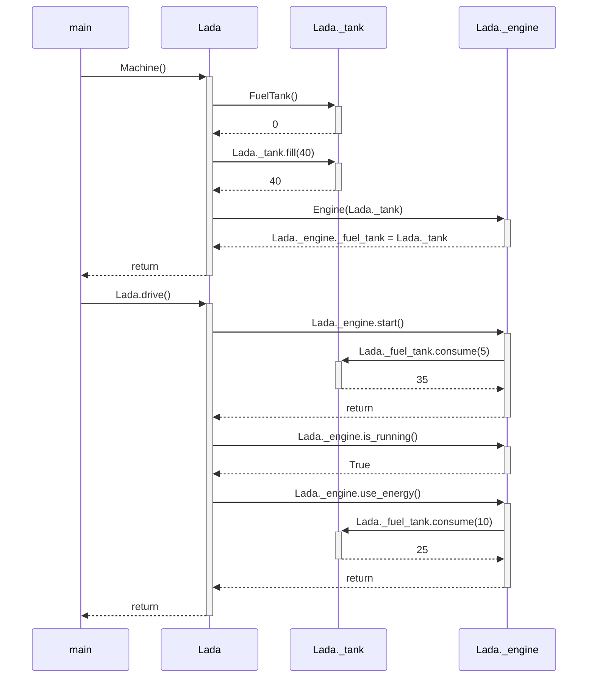

```mermaid
sequenceDiagram
  participant main
  participant Lada
  participant Lada._tank
  participant Lada._engine
  main->>+Lada: Machine()
  Lada->>+Lada._tank: FuelTank()
  Lada._tank-->>-Lada: 0
  Lada->>+Lada._tank: Lada._tank.fill(40)
  Lada._tank-->>-Lada: 40
  Lada->>+Lada._engine: Engine(Lada._tank)
  Lada._engine-->>-Lada: Lada._engine._fuel_tank = Lada._tank
  Lada-->>-main: return
  main->>+Lada: Lada.drive()
  Lada->>+Lada._engine: Lada._engine.start()
  Lada._engine->>+Lada._tank: Lada._fuel_tank.consume(5)
  Lada._tank-->>-Lada._engine: 35
  Lada._engine-->>-Lada: return
  Lada->>+Lada._engine: Lada._engine.is_running()
  Lada._engine-->>-Lada: True
  Lada->>+Lada._engine: Lada._engine.use_energy()
  Lada._engine->>+Lada._tank: Lada._fuel_tank.consume(10)
  Lada._tank-->>-Lada._engine: 25
  Lada._engine-->>-Lada: return
  Lada-->>-main: return
```
