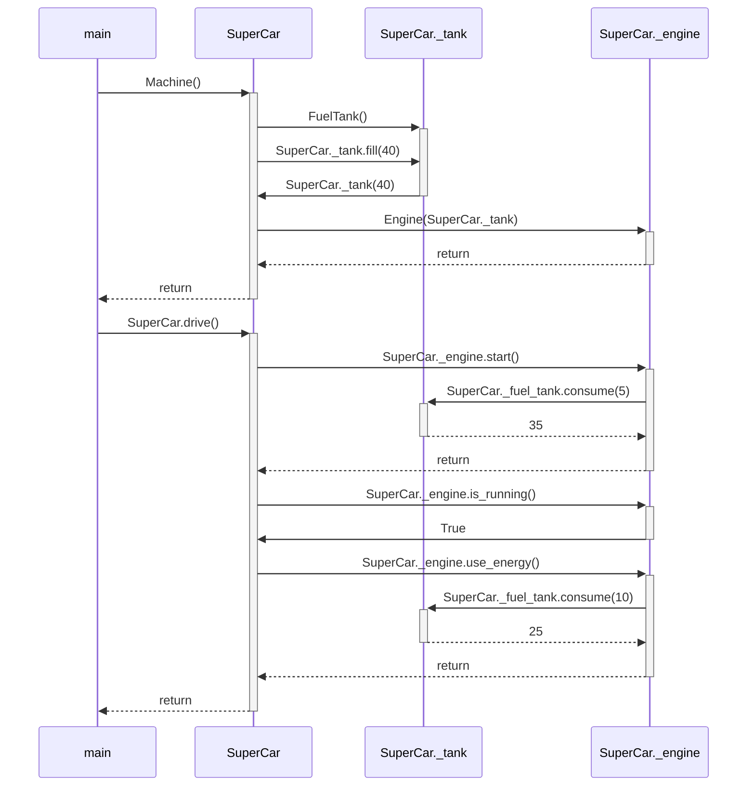

```mermaid
sequenceDiagram
  participant main
  participant SuperCar
  participant SuperCar._tank
  participant SuperCar._engine
  main->>+SuperCar: Machine()
  SuperCar->>+SuperCar._tank: FuelTank()
  SuperCar->>SuperCar._tank: SuperCar._tank.fill(40)
  SuperCar._tank->>-SuperCar: SuperCar._tank(40)
  SuperCar->>+SuperCar._engine: Engine(SuperCar._tank)
  SuperCar._engine-->>-SuperCar: return
  SuperCar-->>-main: return
  main->>+SuperCar: SuperCar.drive()
  SuperCar->>+SuperCar._engine: SuperCar._engine.start()
  SuperCar._engine->>+SuperCar._tank: SuperCar._fuel_tank.consume(5)
  SuperCar._tank-->>-SuperCar._engine: 35
  SuperCar._engine-->>-SuperCar: return
  SuperCar->>+SuperCar._engine: SuperCar._engine.is_running()
  SuperCar._engine->>-SuperCar: True
  SuperCar->>+SuperCar._engine: SuperCar._engine.use_energy()
  SuperCar._engine->>+SuperCar._tank: SuperCar._fuel_tank.consume(10)
  SuperCar._tank-->>-SuperCar._engine: 25
  SuperCar._engine-->>-SuperCar: return
  SuperCar-->>-main: return
```
